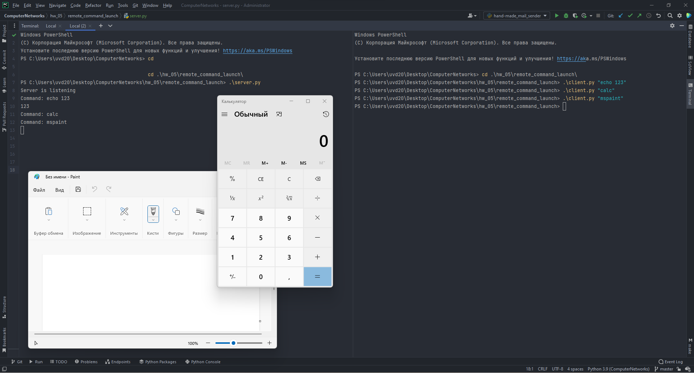

# Setup Guide
## System requirements
* Python 3 (3.9.7 will definitely work).

## Run the app
`python server.py`

The server will start at port 5000.

`python client.py <command>`

The specified `command` will be sent to the server.

##Proof of work

