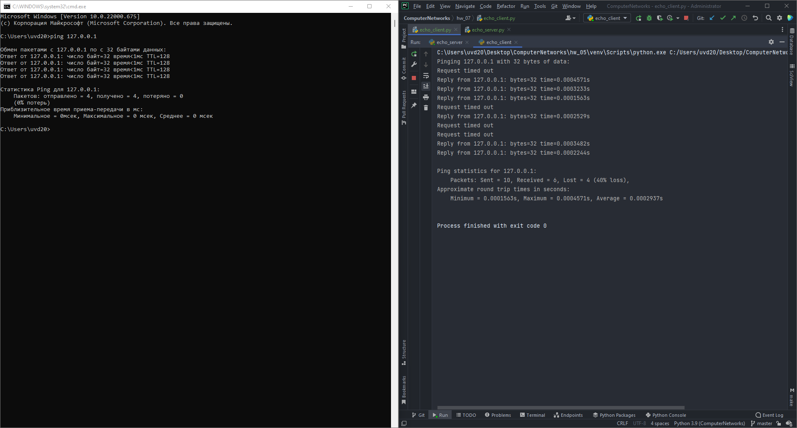

# Setup Guide
## System requirements
* Python 3 (3.9.7 will definitely work).

## Run the app
`python echo_server.py`

The server will start at localhost:5000.

`python echo_client.py <server_host> <server_port>`

The script will ping the host at `server_host:server_port` with 10 messages.

## Proof of work
