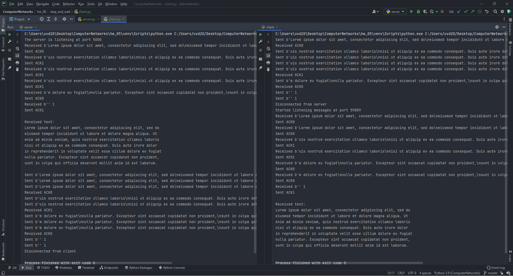

# Setup Guide
## System requirements
* Python 3 (3.9.7 will definitely work).

## Run the app
`python server.py <server_host> <server_port> <timeout>`

The server will start at `server_host:server_port`. It will be listening for incoming messages.
After receiving the message it will send a callback message.

`python client.py <server_host> <server_port> <timeout>`

The client will send message from the `sample_text.txt` file to the host at
`server_host:server_port`. Then the client will be listening for a callback message.

## Proof of work

