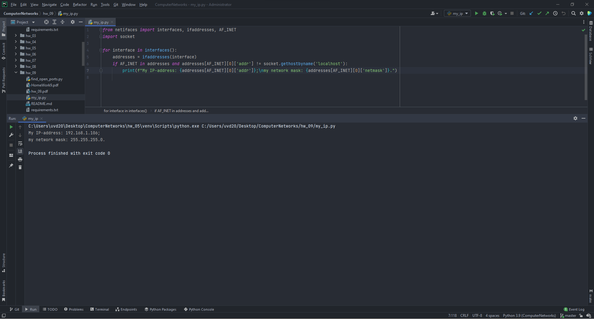
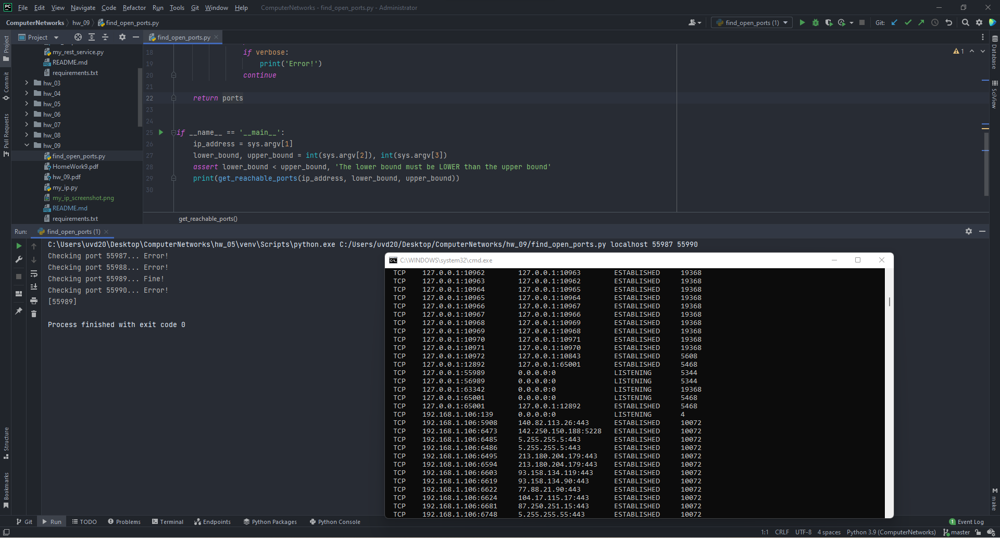

# Setup Guide
## System requirements
* Python 3 (3.9.7 will definitely work).
* pip.

## Installation
Install dependencies with

`pip install -r requirements.txt`

## Run the app
`python my_ip.py`

The app will print out your current IP-address and your network mask.

`python find_reachable_ports.py <ip_address> <lower_bound> <upper_bound>`

The app will print out all open ports from `lower_bound` to `upper_bound`.

## Proof of work

