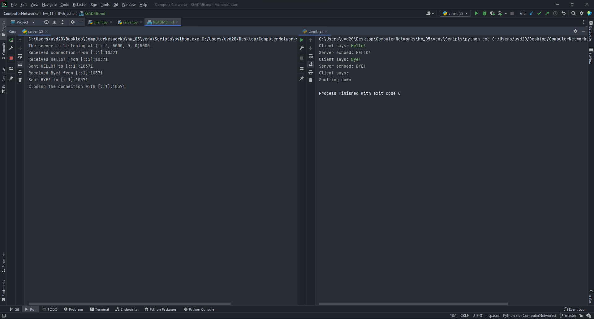

# Setup Guide
## System requirements
* Python 3 (3.9.7 will definitely work).

## Run the app
`python server.py <server_port>`

The server will start at `[::]:server_port`.

`python client.py <server_host> <server_port>`

The client will be forwarding input messages to the server and will be printing out responses to them.

## Proof of work

