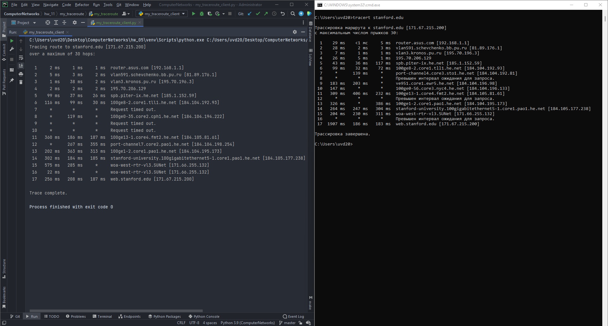

# Setup Guide
## System requirements
* Python 3 (3.9.7 will definitely work).

## Run the app
`python my_traceroute_client.py <server_name_or_host> <number_of_messages> <max_hops>`

The client will figure out the routing hops data has to go through, as well as
response delays as it travels across nodes, which are what send the data toward
its destination.

## Proof of work

