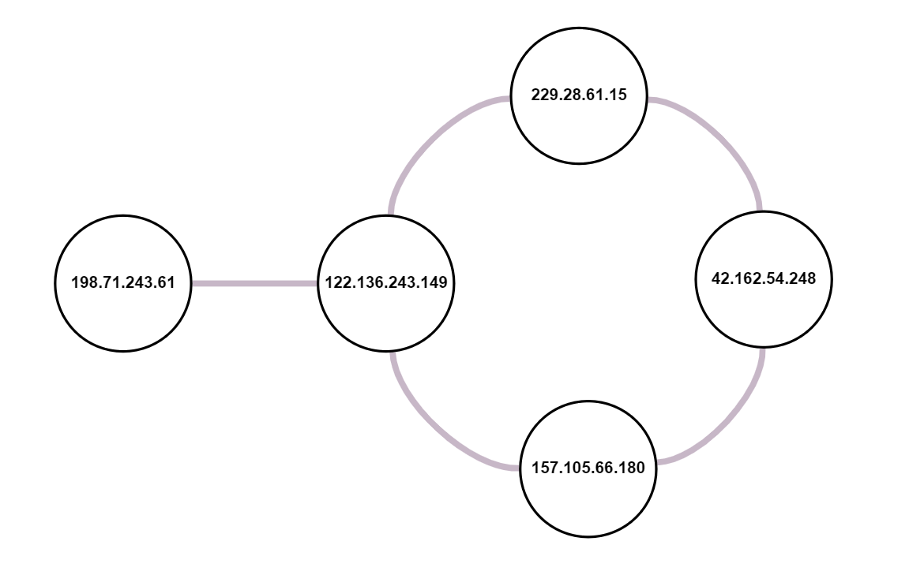

# Setup Guide
## System requirements
* Python 3 (3.9.7 will definitely work).

## Run the app
`python rip_emulator.py <simulation_cycles>`

The app will run a simulation for `simulation_cycles` steps simulating the work of RIP protocol
on a given network. A layout of configured network is represented below.

## Proof of work
File `execution_log.txt` was produced by a command

`python rip_emulator.py 4 > execution_log.txt`

## Network layout

python rip_emulator.py 4 > execution_log.txt
