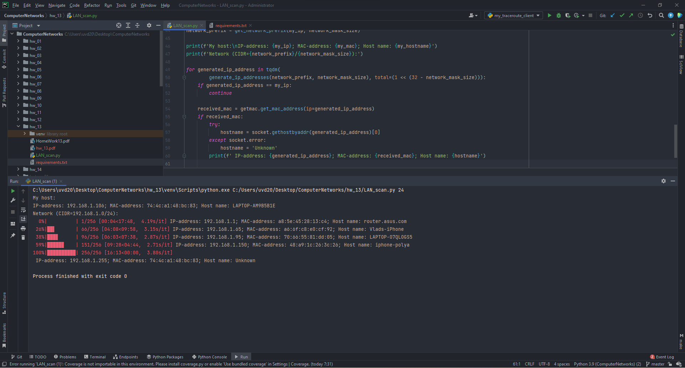

# Setup Guide
## System requirements
* Python 3 (3.9.7 will definitely work).
* pip.

## Installation
Install dependencies with

`pip install -r requirements.txt`

## Run the app
`python LAN_scan.py <network_mask_size>`

The app will scan your LAN for devices. To determine the network's address space
it will use your host's IP-address and the `network_mask_size`.

## Proof of work

